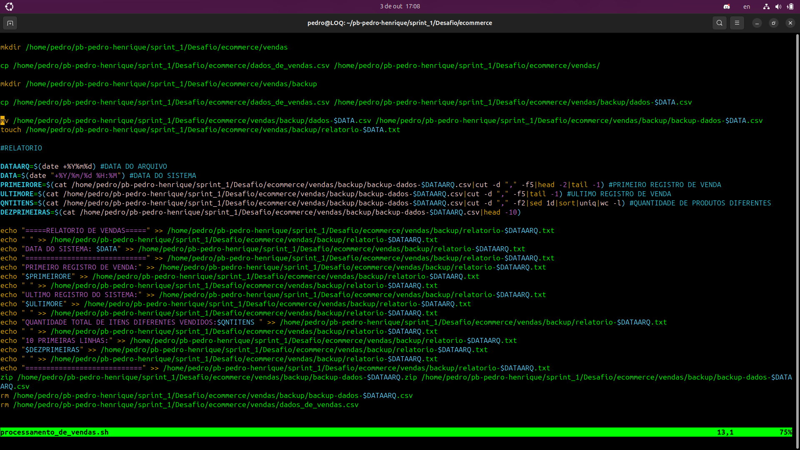
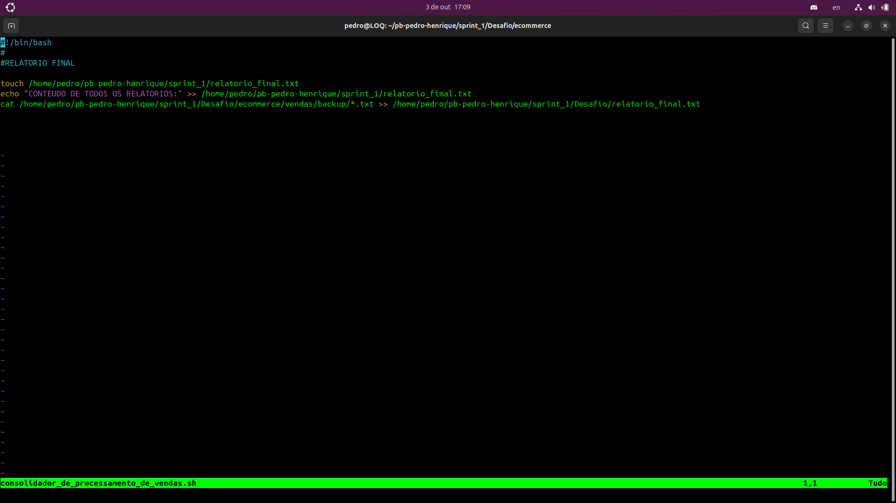

# INFORMAÇÕES

Nessa Sprint aprendi sobre comandos Linux, combiná-los e fazer comandos sequenciais, gerar um script, aprendi os editores de texto no terminal, como agendar os scripts no crontab e como utilizar o git/github para realizar o desafio proposto.

# Exercicios
[Exercicios](Exercícios)

Essa sprint em específico, não possui exercicios

# Evidências
[Evidências](Evidências)
### Scripts

