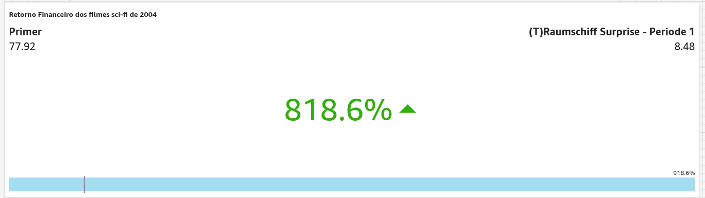
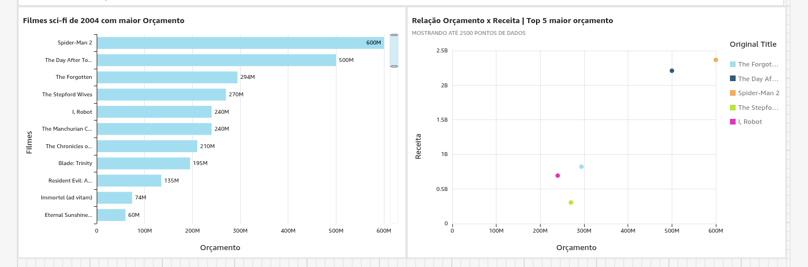
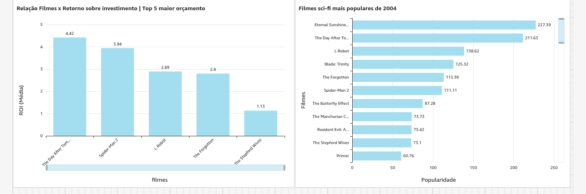
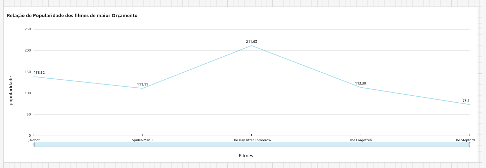

# Desafio
Esse desafio foi mais simples que todos os outros, formular o dashboard foi algo muito simples. Basicamente nesse desafio eu somente mexi no QuickSight e utilizei pouquissimos codigos SQL.

# Etapas

Criei a conta no QuickSight e com o uso de um codigo SQL no Athena, criei uma tabela para servir como meu dataset.

[Codigo_usado](./criar_tabela.sql)

e apartir disso comecei a formular meus gráficos

Nessa KPI, eu utilizei o cálculo ROI(Retorno sobre investimento) que seria basicamente dividir a receita pelo orçamento, e nesse gráfico nós vemos que os filmes "Primer" e "(T)Raumschiff Surprise - Periode 1" foram destaques nesse ano e houve um retorno positivo de 818.6% de forma geral, de todos os filmes lançados nesse ano.

A tabela da esquerda mostra os filmes sci-fi de 2004 que tiveram os maiores orçamentos, já a tabela da direita mostra a relação de orçamento e receita dos 5 filmes com mais investimento do ano, para verificarmos se filmes com alto investimento implica serem os que recebem mais retorno.

A tabela da esquerda mostra o ROI dos 5 filmes com maior orçamento, e confirmamos que filmes com alto orçamento nem sempre são muito lucrativos, "The Spetford Wives" teve um pessimo retorno. A tabela da direita nos mostra os filmes mais populares de 2004, para verificarmos se os filmes que possuem alto investimento também fazem parte dos mais populares.

Nessa tabela nós vemos a popularidade dos 5 filmes de maior orçamento. Notamos que apesar de alto investimento, não é garantido que o filme será popular, como vemos em "The Stepford Wives". Mas notamos também que há sim a relação de orçamento x popularidade, já que os filmes que notamos liderar o gráfico dos mais investidos são encontrados no gráfico dos mais populares.