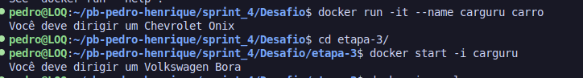
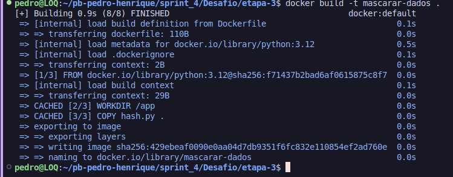
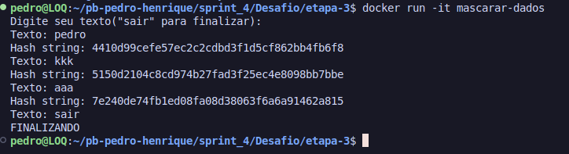

# Desafio
Nessa sprint o desafio consiste em efetuar umas ferramentas do docker para criar imagens e containers utilizando a linguagem python.

# Etapa 1
__Nessa etapa devemos construir uma imagem utilizando um arquivo Dockerfile para executar o [codigo](./carguru.py) e executar um container com base na imagem gerada.__
[Dockerfile](./Dockerfile) - Esse é o arquivo com as instruções Docker.

### Explicacão dos comandos
* FROM: Define a imagem base, no nosso caso, é o python.
* WORKDIR: Define o diretório de trabalho dentro do container, eu defini como o /app.
* COPY: Copia arquivos do seu sistema para o sistema de arquivos do container.
* CMD: Define o comando que será executado quando o container for iniciado, no caso chamamos o python e o arquivo.

* docker build - para construir a imagem. o -t 'nome da imagem' é uma tag para identificar sua imagem, e o ponto . indica que o Dockerfile está no diretório atual.
* docker run -it, o tag "-it" para poder utilizar o terminal na imagem. docker run - esse comando inicia o container e executa o código especificado no CMD.

# Etapa 2
__Nessa etapa foi perguntado se é possivel reutilizar containers.__

Sim, é possível reutilizar containers Docker. Quando um container é parado, ele ainda existe no ambiente Docker e pode ser reiniciado a partir do estado em que foi parado, sem a necessidade de criar um novo container.

Para reiniciar um container parado, você pode usar o comando:
docker start 'nome/id do container'

Utilizei o run novamente agora com a tag --name para renomear a imagem, após isso utilizo o start -i para utilizar o terminal e o nome que dei a imagem.

# Etapa 3
__Devemos criar um script em python que irá receber uma string e converter ela em hash e mostrar o hash na tela, após isso, com o script vamos criar uma imagem e com a imagem devemos criar o container.__
[Dockerfile](./etapa-3/Dockerfile)
Utilizo os mesmos comandos do dockerfile anterior

[Script](./etapa-3/hash.py)

* Importo a biblioteca hashlib
* Faço um print pra mostrar a mensagem na tela
* Dentro do while true eu coloco a condição de parada, caso o usuário digite "sair" o programa é finalizado
* Utilizo o sha1() que cria um objeto de hash
* encode() transforma a string msg em bytes.
* hexdigest() Converte o hash gerado em uma string hexadecimal legível.

## Resultados

