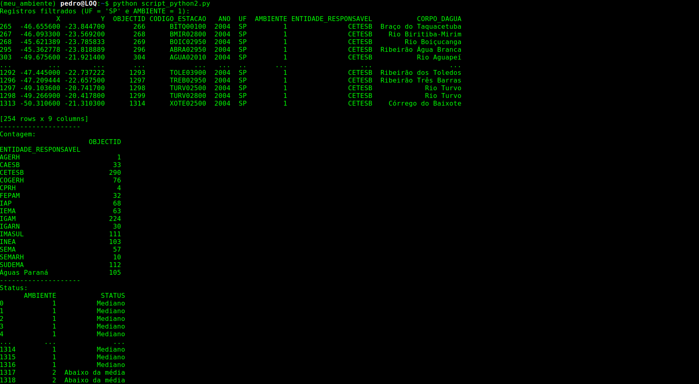
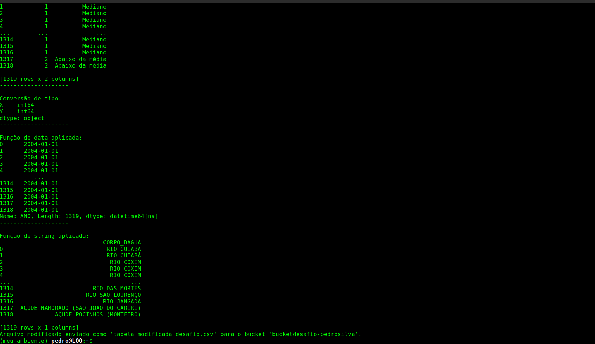
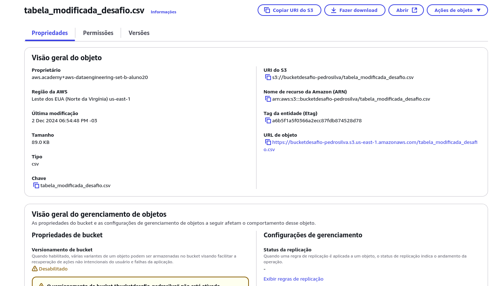

# Desafio
O desafio consiste em aplicar nossos conhecimentos em nuvem AWS e manipular arquivos diretamente do S3. Deviamos pegar um conjunto de dados direto do site do gov e manipular ele com a biblioteca pandas no python.

# Etapa 1 
Escolher o conjunto de dados, eu escolhi esse:

[Tabela](./Entregáveis/tabela_desafio.csv)

__Este é um conjunto de dados da Agência Nacional de Águas e Saneamento Básico, onde registra o ponto de operação do ano de 2004.__

__Observações__: Variáveis ​​X e Y nas Tabelas da ANA: No contexto da Agência Nacional de Águas e Saneamento Básico (ANA), X e Y são provavelmente variáveis ​​usadas para representar dados ou parâmetros específicos em tabelas relacionadas à água e saneamento. Sem informações mais específicas, é difícil determinar o significado exato de X e Y. No entanto, elas podem representar várias métricas, como indicadores de qualidade da água, taxas de fluxo ou outros pontos de dados relevantes usados ​​pela ANA para monitorar e regular os recursos hídricos. O mesmo Ocorre na Coluna 'AMBIENTE' onde a agência não deixa claro o real sentido, porém em fóruns alguns dizem que é relativo a qualidade do saneamento, onde 1 seria: Boa qualidade ou Mediana e 2 seria: Péssima Qualidade ou Pior que a média.

# Etapa 2
Carregar o arquivo para um bucket novo utilizando a biblioteca boto3.
#### Tive problemas com o linux e o ubuntu, então eu precisei criar um ambiente virtual para conseguir utilizar a biblioteca, o mesmo ambiente se encontra em um diretorio dessa sprint.

### imports
* Utilizo _boto3_ que é biblioteca usada para interagir com os serviços da AWS, como S3.
* Uso o __botocore.exceptions__ para tratar de exceções específicas do boto3 de erros relacionados a credenciais, conexão e outros problemas.

### variaveis
* __region_name__: A região onde o bucket está localizado. No caso, é "us-east-1" (Norte da Virgínia).
* __t_name__: Nome do bucket S3 onde o arquivo será enviado.
* __csv_file__: Nome do arquivo CSV local que será enviado.
* __object_name__: Nome que o arquivo terá dentro do bucket (pode ser o mesmo do arquivo local ou outro).

### Criando Cliente
* __boto3.client('s3')__: Cria um cliente S3 usando as credenciais configuradas no ambiente (aws configure). Permitindo realizar operações no serviço S3, como upload de arquivos, download, exclusão, entre outros.

### Upload
* __upload_file__: Nome do arquivo local (csv_file) - Nome do bucket S3 (bucket_name) - Nome que o arquivo terá no bucket (object_name).
* __try__: Envolve o bloco de código que pode gerar erros durante a execução.

**O restante corresponde a tratamentos de erros especificos**

# Etapa 3
No outro script python devemos utilizar a biblioteca pandas para manipular os dados do arquivo que está no S3.

### Para enviar pro Bucket
__utilizei para salvar o DataFrame em Memória:__

* __StringIO__ para salvar o DataFrame como CSV diretamente em memória, evitando criar um arquivo temporário no disco.
* __Enviar ao S3__: put_object é usado para enviar o conteúdo do CSV (armazenado em csv_buffer) ao S3.
* O parâmetro Key recebe o nome do novo arquivo (tabela_modificada_desafio.csv) no bucket.

# Resultados

