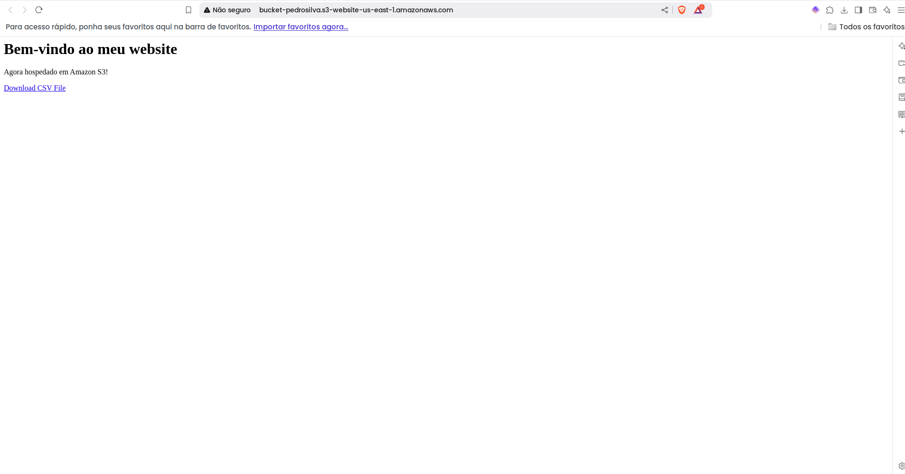
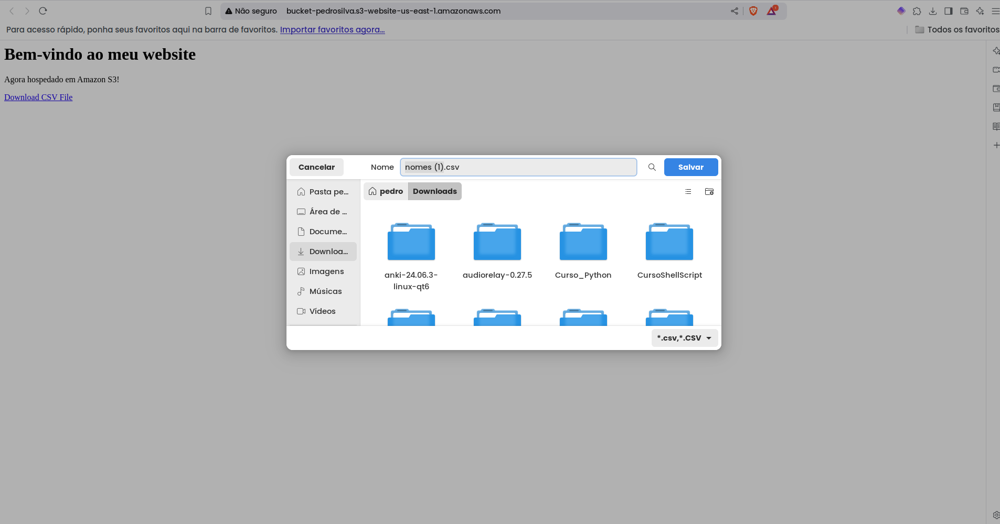

# Informações
Nessa Sprint aprendi sobre os conceitos de nuvem na aws e como utilizar python para subir arquivos para o S3.

# Exercícios
[Exercícios](./Exercícios/)

## Resultado do Exercício:
__Ao acessar o endpoint do site, vamos para essa página:__

__Ao clicar em Download CSV File, O download funciona perfeitamente:__

# Desafio
[Desafio](./Desafio/)

## Entregáveis do Desafio:
[Entregáveis](./Desafio/Entregáveis/)

# Evidências
[Evidências](./Evidências/)

# Certificados
[Certificados](./Certificados/)
