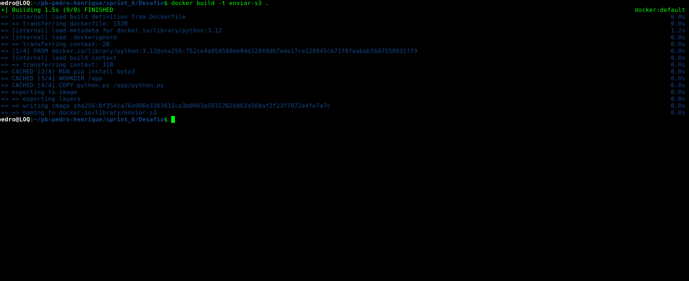
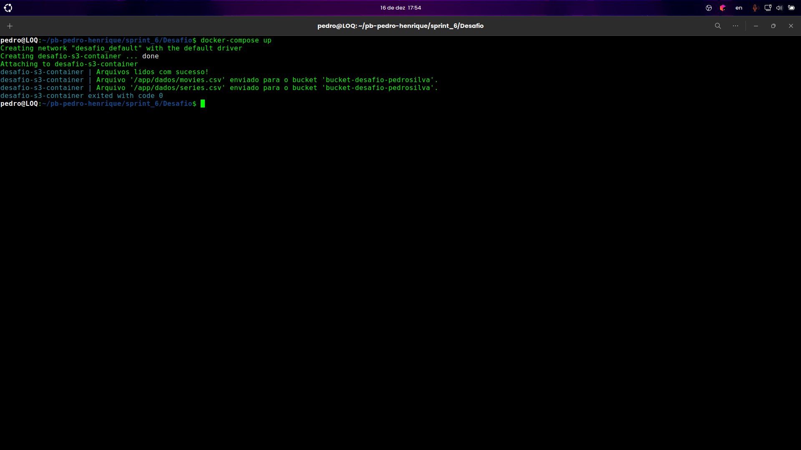
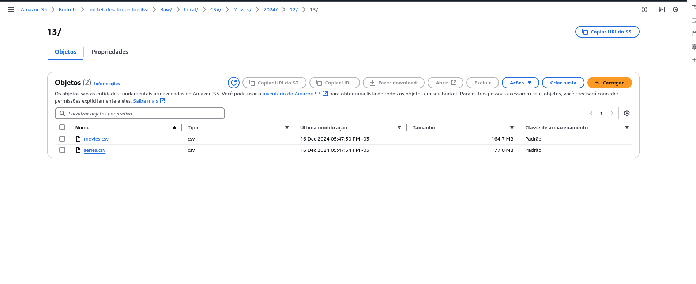

# Desafio
O desafio dessa sprint juntou várias ferramentas que já utilizamos, python, docker, configurar o bucket e enviar para o S3. Devemos criar um script python para ler os dados dos csv e carregar os dados para o bucket, fazer isso utilizando o Docker.

# MINHAS QUESTÕES

* Quais são os filmes de Sci-Fi/Fantasia com as melhores notas médias? - Identificar os maiores sucessos entre o público.
* Como o tempo de duração impacta a avaliação média de filmes Sci-Fi/Fantasia? - Determinar se filmes mais longos ou curtos são mais apreciados.
* Quais filmes de Sci-Fi/Fantasia têm o maior número de votos e por quê?- Explorar a popularidade de filmes específicos e fatores que a influenciam.
* Quais artistas são mais recorrentes em filmes Sci-Fi/Fantasia? - Identificar atores, diretores ou roteiristas importantes no gênero.
* Qual a relação entre o gênero do artista e os papéis mais comuns desempenhados em Sci-Fi/Fantasia? - Explorar questões de diversidade nos elencos do gênero.
* Quais profissões estão mais associadas aos maiores sucessos de Sci-Fi/Fantasia? - Entender a contribuição de diretores, roteiristas, ou outros profissionais no sucesso do gênero.

# Etapa 1
## Script Python

[script_python](./python.py)
* Definição de caminhos absolutos para os arquivos CSV que o script irá manipular, detalhe, /app/dados é o diretorio dentro do container.

*arquivo1 = "/app/dados/movies.csv"*
*arquivo2 = "/app/dados/series.csv"*

* função ler_csv

*Objetivo: Ler o arquivo CSV sem realizar nenhuma operação específica nos dados.*

* open(caminho, 'r', encoding='utf-8'): Abre o arquivo CSV no modo leitura com codificação UTF-8.

* csv.reader(file): Cria um iterador para ler as linhas do arquivo.

* O loop for _ in leitor percorre todas as linhas do arquivo sem fazer nada com elas (usando _ como variável descartável).

*ler_csv(arquivo1)*
*ler_csv(arquivo2)*
*print("Arquivos lidos com sucesso!")*

* Chama a função ler_csv para os dois arquivos declarados.

* Se não houver erros, imprime a mensagem de sucesso.

### Configuração AWS
* region_name: Define a região onde o bucket S3 está localizado (neste caso, us-east-1).

* bucket_name: Nome do bucket no S3 onde os arquivos serão enviados.

* defino o caminho dos arquivos

* salvo eles no bucket seguindo a hierarquia de diretorios. Raw/Local/CSV/Movies/2024/12/13/movies.csv

* Cria um cliente S3 usando a biblioteca boto3

* upload_file(): Faz o upload do arquivo especificado para o bucket S3.

*Parâmetros:*
*arquivo1: Caminho do arquivo no sistema local.*
*bucket_name: Nome do bucket no S3.*
*object_name: Caminho e nome do arquivo no S3.*

# Etapa 2
## Docker
Cria container docker com volume para armazenar os arquivos e executar o script python

[Dockerfile](./Dockerfile)

* FROM - Eu defino a base da imagem, que será em python

* RUN - Instala o pacote boto3

* WORKDIR - Cria o diretorio de trabalho dentro do container

* COPY - Copia arquivos do sistema host para o sistema de arquivos do contêiner.

* CMD - Define o comando que será executado quando o contêiner iniciar

[compose](./docker-compose.yml)

* *Este é um arquivo docker-compose.yml, usado para definir e gerenciar um ou mais contêineres Docker em um ambiente. Utilizei ele para montar o volume.*

* version é a versão do compose, estou usando a 3.12

* services - Define os contêineres que serão criados e gerenciados pelo Docker Compose.

* volumes - Monta diretórios do host (sistema local) dentro do contêiner

# Resultado

