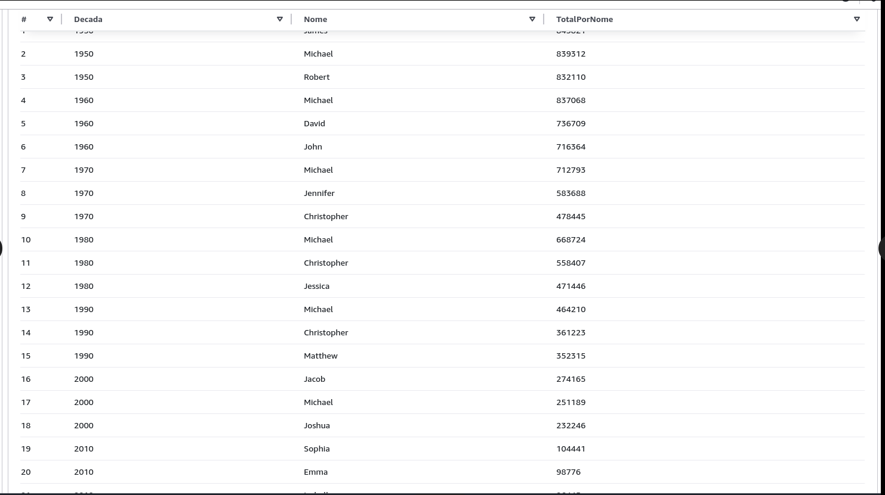
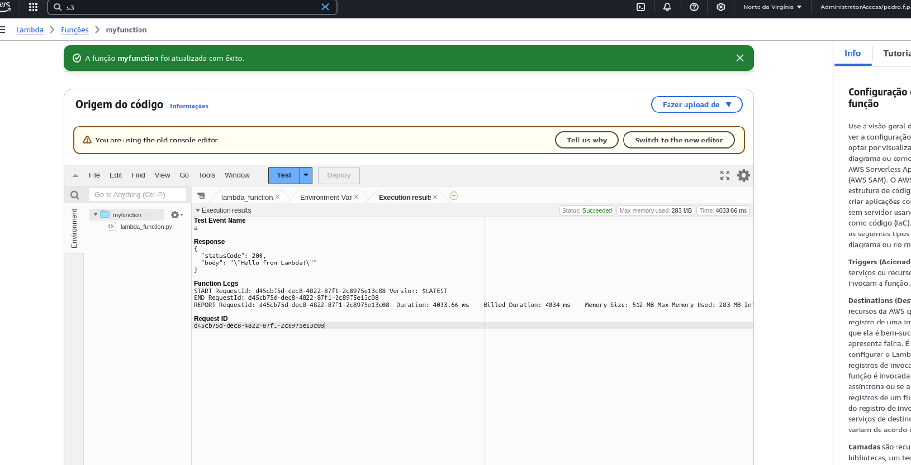

# Informações
Nessa sprint aprendi conceitos aprofundados de analitycs e as ferramentas da AWS para cada um deles.

# Exercicios
[Exercicios](./Exercícios/)

[query-athena](./Exercícios/query-athena.sql)

[lambda](./Exercícios/exercicio_lambda/)

# Desafio
[Desafio](./Desafio/)

# Evidências
[Evidencias](./Evidências/)

# Certificados

