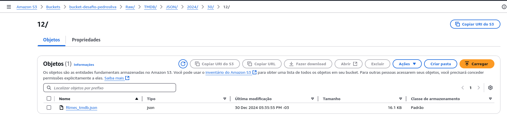
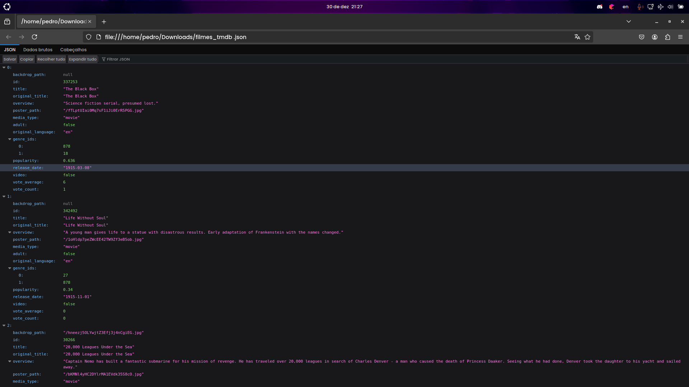

# Desafio
O desafio consistia em acrescentar informações sobre filmes que estavam no csv puxando da API do IMDB em formato JSON e utilizar o Lambda para enviar os dados para o bucket do desafio em formato RAW ZONE

# Etapa 1
__Resumo__: Esse código realiza a busca de informações de filmes a partir de IDs do IMDb usando a API do TMDB e armazena os dados obtidos em um arquivo JSON. Esse arquivo é, então, enviado para um bucket do Amazon S3. O código está estruturado para ser utilizado em uma função Lambda da AWS.

1. Importação de Bibliotecas:
_requests_: Usada para fazer requisições HTTP para APIs externas, como o TMDB.

_json_: Utilizada para manipular dados no formato JSON (converter dados para JSON ou de JSON para objetos Python).

_boto3_: Biblioteca oficial da AWS para interagir com serviços como S3. Neste caso, é usada para enviar dados para um bucket S3.

_botocore.exceptions_: Importa exceções que podem ocorrer ao interagir com a AWS, como erros de credenciais.

_datetime_: Usada para obter a data e hora atual, que será usada para criar um caminho único para armazenar o arquivo no S3.

_os_: Usada para acessar variáveis de ambiente, como a chave de API do TMDB.

2. Definições de Variáveis:
*TMDB_API_KEY*: A chave de API para acessar os dados do TMDB, que é recuperada das variáveis de ambiente.

*BUCKET_NAME*: O nome do bucket S3 onde o arquivo JSON será armazenado.

*s3_client*: Um cliente boto3 para interagir com o serviço S3 da AWS.

*filmes_imdb_ids*: Uma lista de IDs de filmes do IMDb. Esses IDs serão usados para buscar informações sobre os filmes na API do TMDB. Esses filmes fui eu que escolhi a dedo, pois ja os tinha assistido.

3. Função buscar_detalhes_tmdb(id_imdb):
_Objetivo_: Fazer uma requisição para a API do TMDB para obter informações sobre um filme, baseado no ID do IMDb.

_Processo_:
* A URL da API do TMDB é construída dinamicamente com o ID IMDb do filme.

* A função requests.get() é usada para enviar uma requisição GET para a API.

* O parâmetro api_key contém a chave da API, e o parâmetro external_source indica que estamos usando um ID do IMDb para buscar os filmes.

* Se a requisição for bem-sucedida (status 200), a resposta JSON é analisada e se houver resultados de filmes, o primeiro é retornado. Caso contrário, retorna None.

4. Função Lambda lambda_handler(event, context):
_Objetivo_: A função principal que é chamada quando o evento é acionado (geralmente pela AWS Lambda).

_Processo_:
* Um array vazio dados_filmes é criado para armazenar os detalhes dos filmes.

* A função buscar_detalhes_tmdb é chamada para cada ID de filme presente na lista filmes_imdb_ids.

* Se os detalhes do filme forem encontrados, esses detalhes são adicionados ao array dados_filmes.

* O array dados_filmes é convertido para uma string JSON usando json.dumps(), com formatação legível.

* A data atual é obtida com datetime.now(), e essa data é usada para criar um caminho único e organizado no S3 para o arquivo JSON.

* A função s3_client.put_object() é chamada para enviar o arquivo JSON para o bucket S3. O caminho do arquivo é definido pela data atual e o nome do arquivo é "filmes_tmdb.json".

* Se a operação for bem-sucedida, a função retorna uma resposta com status 200 e um corpo JSON indicando que o arquivo foi salvo com sucesso no S3, incluindo o caminho do arquivo no bucket.

* Se ocorrer qualquer erro durante o processo, a função captura a exceção e retorna uma resposta com status 500, incluindo uma mensagem de erro.

5. Manejo de Exceções:
* A função Lambda está preparada para capturar exceções que possam ocorrer durante a execução (por exemplo, falha na requisição da API, problemas ao escrever no S3, ou erros inesperados). Se algum erro ocorrer, a função captura a exceção e retorna um erro HTTP 500 com a mensagem de erro.

_Fluxo Completo_:
* A função Lambda é acionada e começa a executar o código.

* Para cada ID de filme na lista filmes_imdb_ids, a função buscar_detalhes_tmdb é chamada para obter informações do filme usando a API do TMDB.

* Os dados dos filmes são acumulados em uma lista chamada dados_filmes.

* A lista de dados é convertida para o formato JSON e enviada para um bucket S3, usando um caminho gerado dinamicamente baseado na data atual.

* A função Lambda retorna uma resposta indicando sucesso ou falha, conforme o caso.

# Resultados

