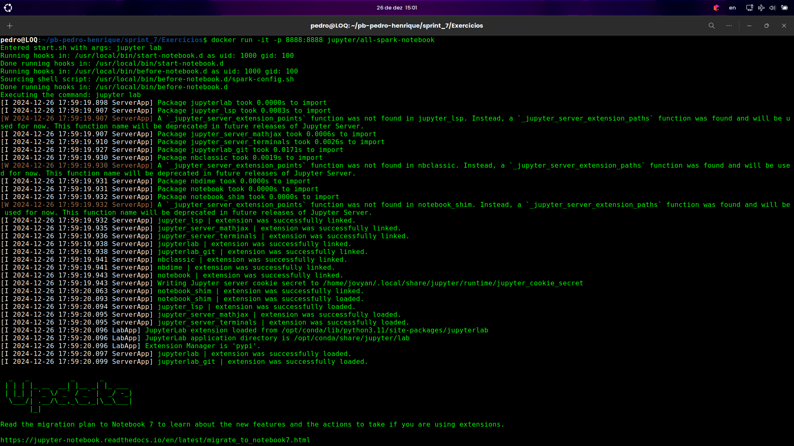
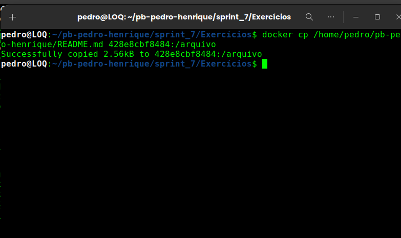
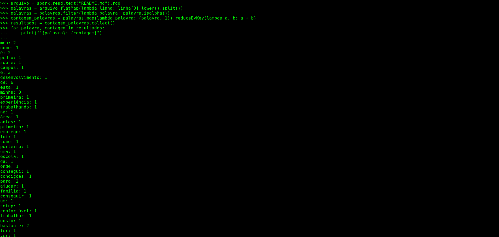
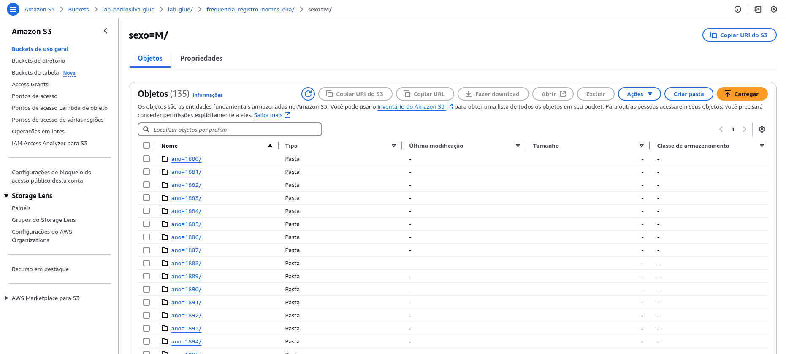
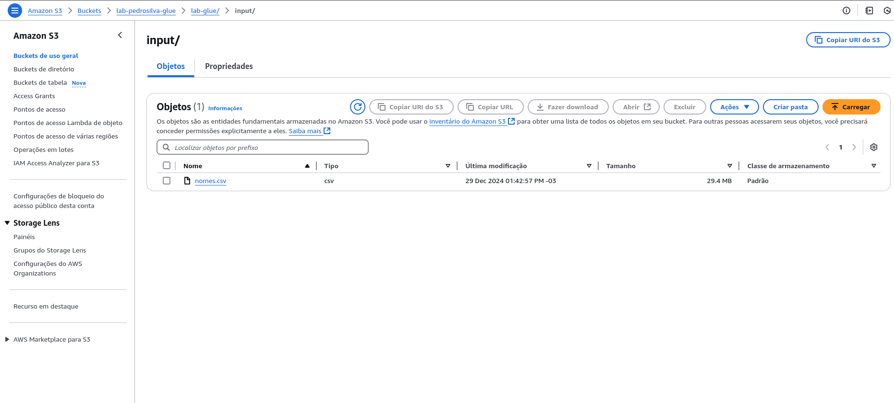

# INFORMAÇÕES
Nessa sprint eu utilizei várias coisas que aprendi ao longo das sprints, como o python, docker, e conhecimentos de AWS, como o lambda, glue, S3.

# Exercicios
[Exercicios](./Exercícios/)

[Exercicio_Spark](./Exercícios/exercicio_contar_palavras.py)

Copiando o readme para o container:

Resultado:

[Exercicio_tmdb](./Exercícios/exercicio_tmdb.py)

[Exercicio_glue](./Exercícios/glue/)

Script utilizado:

# Desafio
[Desafio](./Desafio/)

# Evidências
[Evidencias](./Evidências/)

# Certificados
[Certificados](./Certificados/)