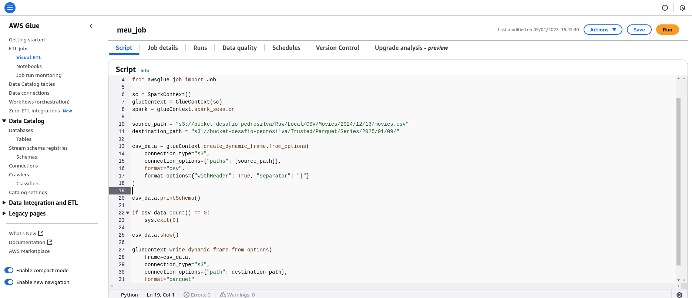
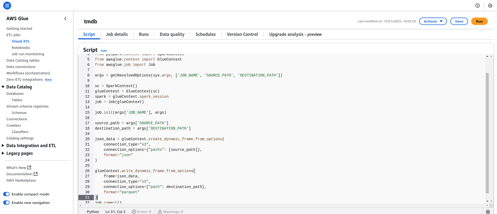
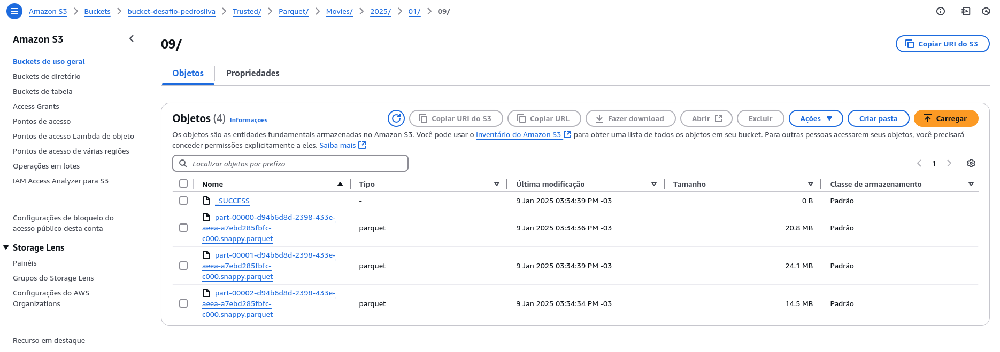
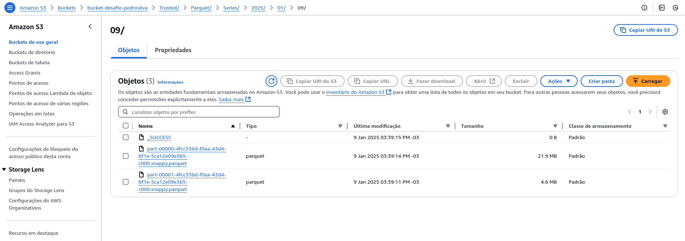
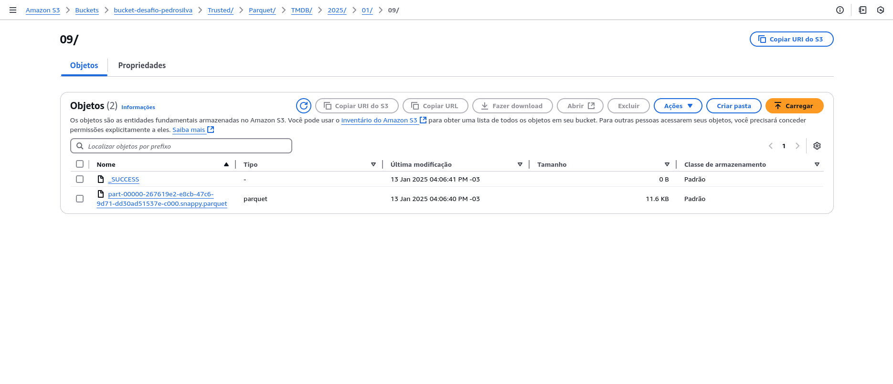

# Desafio
Esse desafio consiste em usar várias das ferramentas que aprendemos, como o python, SQL, S3 e Glue. Elaborar 2 jobs em spark no glue para fazer a transformação do formato dos dados que inserimos no bucket em parquet e criar crawlers para ficarem disponiveis no DataCatalog e podermos fazer consultas no Athena.

# Etapa 1

*Enviando os arquivos movies.csv e series.csv.*

## 1. **Inicializando o Ambiente**
- Primeiro, eu importo as bibliotecas essenciais do AWS Glue e Spark.
- Depois, crio um contexto Spark (`SparkContext`) e um contexto Glue (`GlueContext`).
- Também inicio a sessão Spark para gerenciar as operações de ETL.

## 2. **Definindo os Caminhos Fonte e Destino**
- Eu defino os caminhos no Amazon S3:
  - **Fonte**: Onde o arquivo CSV que vou processar está armazenado. "source_path"
  - **Destino**: Onde vou salvar o arquivo convertido no formato Parquet. "destination_path"

## 3. **Lendo o Arquivo CSV**
- Utilizo o método `create_dynamic_frame.from_options` para ler o arquivo CSV.
- Configuro as seguintes opções:
  - `connection_type`: Especifico que os dados estão no S3.
  - `connection_options`: Indico o caminho exato do arquivo CSV.
  - `format`: Defino que o formato de entrada é CSV.
  - `format_options`: Adiciono detalhes como:
    - O arquivo possui cabeçalho (`withHeader`).
    - O separador utilizado nas colunas é `|`.

## 4. **Validando o Schema**
- Eu utilizo o método `printSchema` para exibir a estrutura das colunas e os tipos de dados do arquivo lido.

## 5. **Visualizando os Dados**
- Utilizo o método `show` para visualizar uma amostra dos registros lidos.

## 7. **Transformando e Salvando os Dados**
- Para salvar os dados, utilizo o método `write_dynamic_frame.from_options`.
- Configuro as opções de saída:
  - `frame`: Indico o dynamic frame contendo os dados processados.
  - `connection_type`: Especifico que o destino está no S3.
  - `connection_options`: Defino o caminho de destino no S3.
  - `format`: Escolho o formato de saída como Parquet.

# Etapa 2

*Enviando o arquivo JSON*

## 1. **Inicializando o Ambiente e Configurando Parâmetros**
- Eu utilizo `getResolvedOptions` para capturar argumentos que são passados ao script. Isso inclui:
**JOB_NAME**: O nome do job no AWS Glue.
**SOURCE_PATH**: O caminho no S3 de onde os arquivos JSON serão lidos.
**DESTINATION_PATH**: O caminho no S3 onde os arquivos Parquet serão salvos.

## 2. **Configurando o Ambiente Spark e Glue**
- Crio um contexto Spark (`SparkContext`) e um contexto Glue (`GlueContext`).
- Também inicializo a sessão Spark para gerenciar as operações de ETL.
- Início o job do Glue com o nome especificado no argumento `JOB_NAME`.

## 3. **Lendo os Dados no Formato JSON**
- Utilizo o método `create_dynamic_frame.from_options` para ler os arquivos JSON da fonte especificada.
- Configuro as opções de conexão:
  - **connection_type**: Indico que os arquivos estão no S3.
  - **connection_options**: Especifico o caminho da fonte através do argumento `SOURCE_PATH`.
  - **format**: Indico que o formato de entrada é JSON.

## 4. **Convertendo e Salvando os Dados no Formato Parquet**
- Depois de carregar os dados, utilizo `write_dynamic_frame.from_options` para gravar os arquivos convertidos no S3.
- Configuro as opções de saída:
  - **frame**: Passo o dynamic frame contendo os dados JSON carregados.
  - **connection_type**: Especifico que os dados serão salvos no S3.
  - **connection_options**: Utilizo o argumento `DESTINATION_PATH` para indicar o local de destino.
  - **format**: Escolho o formato Parquet para o arquivo de saída, pois ele é mais eficiente em termos de armazenamento e consulta.

## 5. **Finalizando o Job**
- Chamo o método `job.commit()` para sinalizar que o job foi concluído com sucesso.

# Resultados

