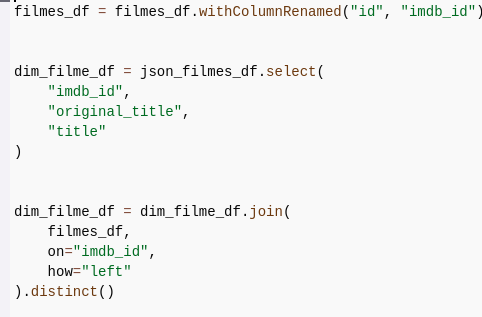
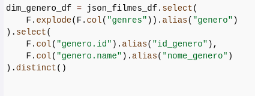
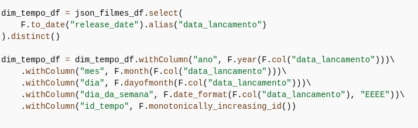
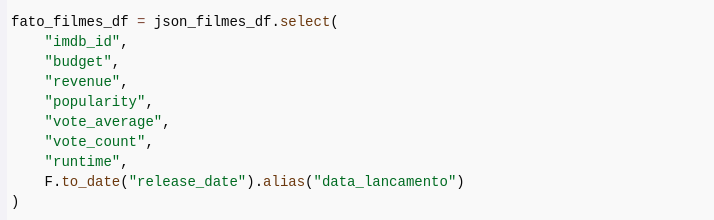
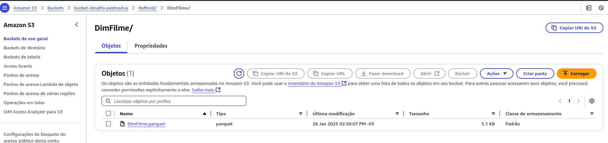
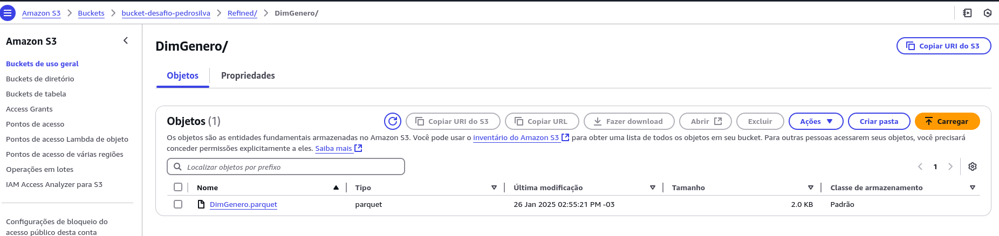
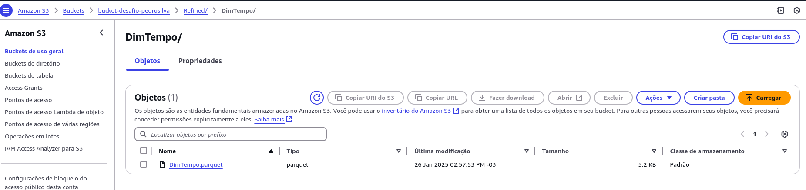
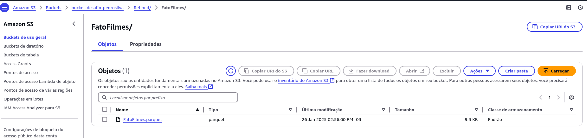
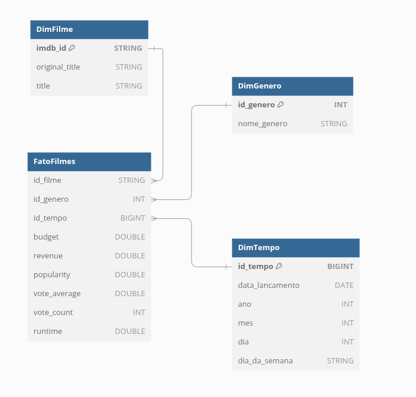

# Desafio
Neste código, eu implementei um processo ETL utilizando PySpark e o contexto do AWS Glue. Aqui está uma explicação detalhada, passo a passo, do que cada parte do código faz:

# Etapa 1
### Configuração Inicial

**from pyspark.context import SparkContext**
**from awsglue.context import GlueContext**
**from pyspark.sql import functions as F**

1. Importei as bibliotecas necessárias para configurar o ambiente do Spark e manipular os dados.

2. Criei o SparkContext e o GlueContext:

**sc: Gerencia as configurações do Spark.**
**glueContext: Integrar o Spark com o Glue.**
**spark: Sessão do Spark usada para trabalhar com DataFrames.**

3. Definição dos Caminhos no S3

**input_filmes_parquet = "s3://bucket-desafio-pedrosilva/Trusted/Movies/Parquet/2025/01/09/filmes.parquet"**
**input_json_filmes = "s3://bucket-desafio-pedrosilva/Trusted/TMDB/Parquet/2025/01/09/tmdb_json.parquet"**
**output_s3_path = "s3://bucket-desafio-pedrosilva/Refined/"**

4. Defini os caminhos de entrada e saída no S3:

**filmes.parquet: Contém informações básicas sobre filmes e referencia o csv.**
**tmdb_json.parquet: Contém informações detalhadas sobre filmes e referencia o JSON.**

3. Carregamento dos Dados

**filmes_df = spark.read.parquet(input_filmes_parquet)**
**json_filmes_df = spark.read.json(input_json_filmes)**

Usei spark.read.parquet para carregar o arquivo Parquet.

4. Criar a Dimensão DimFilme

* Renomeei a coluna id de filmes_df para imdb_id, garantindo consistência com o JSON.

* Extraí os atributos necessários para a dimensão:
imdb_id, original_title e title.

* Fiz um join com o DataFrame do Parquet para integrar informações adicionais.

* Removi duplicatas com .distinct().

5. Criar a Dimensão DimGenero

* Explodi a lista de gêneros (genres) em linhas individuais usando F.explode.

* Extraí os atributos dos gêneros:
id como id_genero.
name como nome_genero.

* Removi duplicatas, garantindo que cada gênero apareça apenas uma vez.

6. Criar a Dimensão DimTempo

* Transformei a coluna release_date em formato de data (data_lancamento).

* Calculei atributos temporais:
ano, mes, dia e dia_da_semana.

* Adicionei um identificador único (id_tempo) com monotonically_increasing_id.

7. Criar a Tabela Fato FatoFilmes

* Selecionei os atributos numéricos e de popularidade para a tabela fato.

* Realizei joins com DimTempo e DimGenero para adicionar informações temporais e de gênero.

* Criei a tabela fato final, com métricas numéricas e chaves estrangeiras para as dimensões.

8. Salvando as Tabelas no S3
**dim_filme_df.write.mode("overwrite").parquet(f"{output_s3_path}DimFilme/")**

**dim_genero_df.write.mode("overwrite").parquet(f"{output_s3_path}DimGenero/")**

**dim_tempo_df.write.mode("overwrite").parquet(f"{output_s3_path}DimTempo/")**

**fato_filmes_df.write.mode("overwrite").parquet(f"{output_s3_path}FatoFilmes/")**

# Resultado:

# Modelo Dimensional

